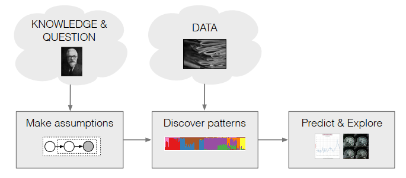
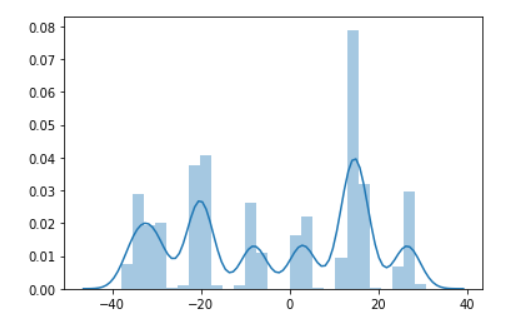
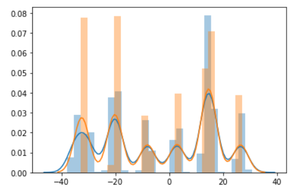

[TOC]

## 一、贝叶斯推断的工作流

在贝叶斯推断方法中，工作流可以总结为：

1. 根据观察者的知识，做出合理假设，假设数据是如何被生成的
2. 将数据的生成模型转化为数学模型
3. 根据数据通过数学方法，求解模型参数
4. 对新的数据做出预测



在整个pipeline中，第1点数据的生成过程，这是业务相关的，需要丰富的领域知识。第二点是连接业务领域和数学领域的桥梁，一般称之为数学建模，第3点是存粹的数学步骤，使用数学工具求解模型参数。第4步为业务应用，为业务做出预测和推断结果。

## 二、一个业务例子

下面以一个业务例子来实践这个pipeline。假设在我们的app中总用户数为k，并且在app的数据库中记录了用户每日使用时长的增长量，假设我们没有任何关于用户的唯一id，能观测到的只有增量值: `[-6.04231708, -1.64784446, ..., 1.63898137, -4.29063685, -0.87892713]` ，我们需要做的是为每个用户赋予一个用户id，并且在未来时刻给定某个用户使用时长增量，将这个时长增量归属到其用户id上，如此便可以建立每个用户的使用时长记录，以便在商业上分析用户行为。

首先，于是我们根据业务知识，知道用户产生时长增量记录的过程为：

1. 某个用户$c_k$ 登录系统 
2. 用户产生一条使用时长增量记录$x_i$,

然后，我们将这个过程建模为数学问题：假设登录到系统上的用户为$k'$的概率是均匀分布的，概率都为$\frac{1}{k}$，并且用户$k'$生的时长增量为一个随机变量，其符合均值为$u_k$, 标准差为$1$的分布，并且$u_{k}$自身也是符合均值为0，方差为$\sigma$的高斯分布，特别注意的是$\sigma$是一个人工设定的超参数，为领域专家根据先验知识调整的。数学化的表述如下:
$$
\begin{aligned} \mu_{k} & \sim \mathcal{N}\left(0, \sigma^{2}\right), & k &=1, \ldots, K \\ c_{i} & \sim \operatorname{Categorical}(1 / K, \ldots, 1 / K), & & i=1, \ldots, n \\ x_{i} | c_{i}, \mu & \sim \mathcal{N}\left(c_{i}^{\top} \mu, 1\right) & & i=1, \ldots, n \end{aligned}
$$
其中$c_i$为指示向量，它指明了当前这条数据$x_i$是由哪个用户产生的，假如由用户1产生的，那么对应的指示向量为$c_i=[0,1,0,...,0,0]$，$u$为k维向量，每一维度为$u_k$, 即$u=[u_1, u_2, ..., u_k]$根据上面的描述，我们可以用python代码写出整个数据产生的过程:

```python
def gen_data(sigma, k, n):
    #获取u_k
    u_k = np.random.normal(0, sigma, k)
    print(u_k)
    x = []
    c = []
    for i in range(n):
        ci = random.choice(range(k))
        c.append(ci)
        u = u_k[ci]
        x.append(np.random.normal(u, 1))
    return x, u_k, c
```

我们使用这个函数产生$(\sigma=10, k=10)$实验室数据，采样得到的$u=[-34.59, -30.27, -20.69, -19.65, -8.04, 3.0, 13.79, 14.6, 15.65, 26.56]$, 数据x分布如下图:



于是我们的目标是根据数据x，去计算得出$u$，然后未来有数据$x'$到来时查看数据与$u_{i\in k}$的距离，选择距离最近的$i=argmin_{i} dis(u_{i \in k}, x')$赋予该条数据作为其用户id即可。

## 三、变分推断

上述问题的思路很直接，就是根据条件概率公式，计算$u, c$的后验分布，选择后验概率最大的$u, c$即可
$$
p(u, c|x)=\frac{p(u, c, x)}{p(x)} 
$$
OK， 说干就干，首先根据第二节的数学模型，写出分子部分:
$$
p(\mathbf \mu, \mathbf{c}, \mathbf{x})=p(\mu) \prod_{i=1}^{n} p\left(c_{i}\right) p\left(x_{i} | c_{i}, \mu\right) \tag{1}
$$
然后写出分母部分:
$$
p(\mathbf{x})=\int p(\boldsymbol{\mu}) \prod_{i=1}^{n} \sum_{c_{i}} p\left(c_{i}\right) p\left(x_{i} | c_{i}, \mu\right) \mathrm{d} \mu
$$
这个问题在于计算$p(x)$存在一个对$u$的多维积分，在这个例子中，有10个用户即意味着10维积分，计算复杂度随着$u$的维度指数增长，在现实世界里$u$的维度小则几千几万，大则千万上亿，计算$p(x)$是现有计算机的计算能力无法完成的，变分推断的出现就是为了解决这个难题。

变分推断的思路是将该问题转换为一个最优化问题，并通过现有高效的最优化方法来进行求解。首先我们将无法观测到的隐藏变量聚拢为$z=(u, c)$，然后使用一个分布$q(z)$来逼近$p(z|x)$，两个分布之间的逼近程度用KL散度来衡量，于是我们的问题被转化成为了一个最小化$KL(q(z)||p(z|x))$的最优化问题，形式化地表述为:
$$
q(z)^*=\mathop{\arg \min}_{q(z)} KL(q(z)||p(z|x))
$$
我们将KL散度展开为:
$$
\begin {aligned}
\operatorname{KL}(q(\mathbf{z}) \| p(\mathbf{z} | \mathbf{x})) &= \mathbb{E}_{q(z)}[\log q(\mathbf{z})]-\mathbb{E}_{q(z)}[\log p(\mathbf{z} | \mathbf{x})] \\
&= \mathbb{E}_{q(z)}[\log q(\mathbf{z})]-\mathbb{E}_{q(z)}[\log p(\mathbf{z,x})] +\log p(x)
\end {aligned}
$$
在最小化的过程中由于$\log p(x)$难以计算，于是退而求其次，稍作变换最小化目标为$\mathbb{E}_{q(z)}[\log q(\mathbf{z})]-\mathbb{E}_{q(z)}[\log p(\mathbf{z,x})]$, 等同于最大化其取负后的结果，形式化地表述如下:
$$
q(z)^*=\mathop{\arg \max}_{q(z)} \mathbb{E}_{q(z)}[\log p(\mathbf{z}, \mathbf{x})]-\mathbb{E}_{q(z)}[\log q(\mathbf{z})]
$$
上述地优化目标被称之为evidence lower bound ，即ELBO, 国内有翻译为“证据下界”，也有翻译为“变分下界”。换个角度来看ELBO，其实$ELBO(q(z))=\log p(x) - KL(q(z)||p(z|x))$，因为KL散度的非负性，于是有:
$$
\log p(x) \ge ELBO(q(z))
$$
所以本质上最大化ELBO就是在最大化$\log p(x)$，这一点在最大似然估计和最大后验估计上思路都是相似的。最后，只要我们最后选择一个参数化的$q(z)$，然后使用最优化算法即可求解原问题。


## 四、平均场理论

选取合适的参数化$q(z)$可以使得求解原问题变得简单易行，当我们取$q(z)=q(z|x; \theta_t)$时，就得到了EM算法，具体展开ELBO并且迭代求解即可。但这里介绍另一种求解方法: 平均场。平均场理论并不假设具体$q(z)$的函数形式，但它假设隐变量之间相互独立:
$$
q(\mathbf{z})=\prod_{j=1}^{m} q_{j}\left(z_{j}\right)
$$
这在很多场合下是符合直觉的，例如在上述场景中，用户使用时长的增量分布大都由自身兴趣爱好决定，两个用户之间对app的使用的时长程度并不相关。

为了求解模型，我们将平均场假设带入ELBO，首先处理第一部分:
$$
\begin {aligned}
\mathbb{E}_{q(z)}[\log p(\mathbf{z}, \mathbf{x})] &= \int q(\mathbf{z}) \log p(\mathbf{z}, \mathbf{x}) d\mathbf{z} \\
&= \int \prod_{i} q(z_i) \log p(\mathbf{z}, \mathbf{x}) dz_i \\
&= \int q(z_j) \left[ \int \prod_{i \neq j} q(z_i) \log p(\mathbf{z}, \mathbf{x}) dz_i \right ] dz_j \\
&= \int q(z_j) \mathbb{E}_{q(z_{i\neq j})} \left[ \log p(\mathbf{z}, \mathbf{x}) \right]dz_j
\end {aligned}
$$
接着处理第二部分:
$$
\begin {aligned}
\mathbb{E}_{q(z)}[\log q(\mathbf{z})] &=
\underset{q\left(z_{j}\right)}{\mathbb{E}}\left[\log q_{j}\left(z_{j}\right)\right]-\underset{q_{i\neq j}\left(z_{i}\right)}{\mathbb{E}}\left[\sum_{i \neq j} \log q_{i}\left(z_{i}\right)\right] \\
&= \left[ \int q(z_j) \log q(z_j) dz_j \right] - \underset{q_{i\neq j}\left(z_{i}\right)}{\mathbb{E}}\left[\sum_{i \neq j} \log q_{i}\left(z_{i}\right)\right]
\end {aligned}
$$
两部分合起来得到:
$$
ELBO(q(\mathbf z))=\left[ \int q(z_j) \mathbb{E}_{q(z_{i\neq j})} \left[ \log p(\mathbf{z}, \mathbf{x}) \right]dz_j \right]  - \left[ \int q(z_j) \log q(z_j) dz_j \right] + \underset{q_{i\neq j}\left(z_{i}\right)}{\mathbb{E}}\left[\sum_{i \neq j} \log q_{i}\left(z_{i}\right)\right]
$$
这里利用坐标上升法进行优化在每一轮迭代时，将$q(z_{i \neq j})$固定，然后优化$q(z_j)$。于是我们能把注意力集中到$q(z_j)$上来，在上面式子中$q(z_{i \neq j})$已经固定，这时候$\underset{q_{i\neq j}\left(z_{i}\right)}{\mathbb{E}}\left[\sum_{i \neq j} \log q_{i}\left(z_{i}\right)\right]=c$为常数，于是上面式子可以简化一下:
$$
ELBO(q(z_j))=\left[ \int q(z_j) \mathbb{E}_{q(z_{i\neq j})} \left[ \log p(\mathbf{z}, \mathbf{x}) \right]dz_j \right]  - \left[ \int q(z_j) \log q(z_j) dz_j \right] + c
$$
最后我们令$\log D=\mathbb{E}_{q(z_{i\neq j})} \left[ \log p(\mathbf{z}, \mathbf{x}) \right]$, 于是得到:
$$
\begin {aligned}
ELBO(q(z_j)) &= \left[ \int q(z_j) \log D dz_j \right]  - \left[ \int q(z_j) \log q(z_j) dz_j \right] + c \\
&= -KL(q(z_j)||D) + c
\end {aligned}
$$
由KL散度可以知道当取$q(z_j)=D$即:
$$
q(z_j)=e^{\mathbb{E}_{q(z_{i\neq j})} \left[ \log p(\mathbf{z}, \mathbf{x}) \right]} \tag{2}
$$


时KL散度最小为0，有$EBLO(q(z_j))=c$最大。于是我们得到了平均场变分推断算法:

1. 迭代计算每一个$q(z_j)=e^{\mathbb{E}_{q(z_{i\neq j})} \left[ \log p(\mathbf{z}, \mathbf{x}) \right]}$
2. 计算$ELBO(q(\mathbf z))$，如果ELBO收敛，则结束，否则返回第一步

## 五、业务CASE的平均场变分推断求解

为了求解第三节中的问题，根据平均场变分推断的思路，我们先假设隐变量$u_k$的分布满足均值为$m_k$, 方差为$s_k$，而隐变量$c_i$由参数$\varphi_i$决定, 参数也是k维向量，每一维度指定了$c_i$对应维度为1的概率，即:
$$
q(c_i;\varphi_i)=\sum_k c_{ik}\varphi_{ik} \tag{3}
$$


于是根据平均场假设有:
$$
p(\mathbf \mu, \mathbf c)=\prod_{k}q(\mu_k;m_k,s_k)\prod_iq(c_i;\varphi_i)
$$
式子(1)被重写为:
$$
p(\mathbf \mu, \mathbf c, \mathbf x) = \prod_k p(\mu_k;m_k,s_k) \prod_i p(c_i;\varphi_i) p(x_i|c_i,\mathbf \mu)
$$
于是ELBO为:
$$
\begin {aligned}
ELBO(\mathbf m, \mathbf s,\mathbf \varphi) &= \sum_k \mathbb E_{q(\mu_k;m_k,s_k)} \left[ \log p(u_k;m_k,s_k) \right] \\ 
&+ \sum_i \left( \mathbb E_{q(c_i;\varphi_i)} \left[ \log p(c_i; \varphi_i) \right] + \mathbb E_{q(c_i;\varphi_i)} \left[ \log p(x_i|c_i,\mathbf \mu; \mathbf m, \mathbf s, \varphi_i) \right]  \right) \\
& - \sum_k \mathbb E_{q(\mu_k;m_k,s_k)}\left[ \log q(\mu_k;m_k, s_k) \right] \\
& - \sum_i \mathbb E_{q(c_i;\varphi_i)} \left[ \log q(c_i; \varphi_i) \right]
\end {aligned} \tag{4}
$$
在算法运行的每一轮迭代中，先求解$q(c_i; \varphi_i)$：
$$
\begin {aligned}
\log q(c_i; \varphi_i) &= \mathbb{E}_{q(\mathbf \mu;\mathbf m,\mathbf s)} \left[ \log p(\mathbf c,  \mathbf{\mu}, \mathbf{x}) \right] \\
&= \log p(c_i) +  \mathbb{E}_{q(\mathbf \mu;\mathbf m,\mathbf s)} \left[ \log p(x_i|c_i,\mathbf \mu; \mathbf m, \mathbf s, \varphi_i) \right]
\end {aligned}
$$
根据业务上的定义$\log p(c_i)=-\log k$为常数，并且根据$c_i$的定义有$p(x_i|c_i, \mathbf \mu)=\prod_k p(x|\mu_k)^{c_{ik}}$, 其中$c_{ik}$为$c_i$的第k维值，于是
$$
\begin{aligned}
\log q(c_i; \varphi_i) &= \mathbb{E}_{q(\mathbf \mu;\mathbf m,\mathbf s)} \left[ \log p(x_i|c_i,\mathbf \mu; \mathbf m, \mathbf s, \varphi_i) \right] + const\\
&= \sum_k c_{ik}\mathbb{E}_{q(\mathbf \mu_k;m_k,s_k)} \left[ \log p(x_i|\mathbf \mu_k; m_k, s_k) \right] + const \\
&= \sum_k c_{ik}\mathbb{E}_{q(\mathbf \mu_k;m_k,s_k)} \left[ \frac{-(x_i-\mu_k)^2}{2}; m_k, s_k \right] + const \\
&= \sum_k c_{ik} \left( \mathbb{E}_{q(\mathbf \mu_k;m_k,s_k)} \left[ \mu_k;m_k, s_k \right]x_i - \frac{1}{2} \mathbb{E}_{q(\mathbf \mu_k;m_k,s_k)} \left[\mu_k^2;m_k,s_k\right] \right) + const
\end{aligned} \tag{5}
$$
对比式子(3)和(5), 很显然有:
$$
\varphi_{ik} = e^{\mathbb{E}_{q(\mathbf \mu_k;m_k,s_k)} \left[ \mu_k;m_k, s_k \right]x_i - \frac{1}{2} \mathbb{E}_{q(\mathbf \mu_k;m_k,s_k)} \left[\mu_k^2;m_k,s_k\right]}
$$
在这里根据$q(\mu_k;m_k,s_k)$的定义，可以知道$\mathbb{E}_{q(\mathbf \mu_k;m_k,s_k)} \left[ \mu_k;m_k, s_k \right]x_i=m_kx_i$而$\mathbb{E}_{q(\mathbf \mu_k;m_k,s_k)} \left[\mu_k^2;m_k,s_k\right]=s_k^2+m_k^2$于是:
$$
\varphi_{ik}=m_k-\frac{1}{2}(s_k^2+m_k^2) \tag{6}
$$


接下来 继续来求解$q(\mu_k;m_k,s_k)$
$$
\begin {aligned}
\log q(\mu_k;m_k,s_k) &= \log p(\mu_k) + \sum_i \mathbb E_{q(c_i,\mathbf \mu_{k})}\left[  \log p(x_i|c_i, \mathbf \mu_k; \varphi_i, \mathbf m_{-k}, \mathbf s_{-k}) \right] \\
&= -\frac{\mu_k^2}{2\sigma^2} + \sum_i \varphi_{ik} \left(\frac{-(x_i-u_k)^2}{2} \right) + const \\
&= \mu_k \left( \sum_i\varphi_{ik}x_i \right) - \mu_k^2 \left( \frac{1}{2\sigma^2} + \sum_i \frac{\varphi_{ik}}{2} \right) + const
\end {aligned} \tag{7}
$$
观察高斯分布的形式$p(x)=\frac{1}{\sqrt{2\pi}s}e^{\frac{-(x-\mu)^2}{2s^2}}$于是有:
$$
\begin{aligned}
\log p(x) &= -\log (\sqrt{2\pi}s) - \frac{(x-\mu)^2}{2s^2} \\
&= -\log (\sqrt{2\pi}s) -  \frac{x^2}{2s^2}-\frac{\mu^2}{2s^2} + \frac{x\mu}{s^2}
\end{aligned} \tag{8}
$$
对比(7)和(8)式，可见实际上$q(u_k;m_k, s_k)$是一个高斯分布，于是可以令:
$$
\frac{1}{2s_k^2}=\frac{1}{2\sigma^2} + \sum_i \frac{\varphi_{ik}}{2}
$$
可以解出来:
$$
s_k= \frac{1}{\sqrt{\frac{1}{\sigma^2}+\sum_i \varphi_{ik}}} \tag{9}
$$
同理可以令:
$$
\frac{m_k}{s_k^2}=\sum_i \varphi_{ik}x_i \tag{10}
$$
把（9）带入即可解得:
$$
m_k=\frac{\sum_i \varphi_{ik}x_i}{\frac{1}{\sigma^2}+\sum_i \varphi_{1k}} \tag{11}
$$
最后我们得到了所有参数的更新公式，总结求解过程为:

1. 随机初始化所有参数$\mathbf \varphi,  \mathbf m, \mathbf s$
2. 按照(6)式子更新每一个参数参数$\varphi_i$
3. 按照(9)式更新每一个参数$s_k$
4. 按照(10)式更新每一个参数$m_k$
5. 按照(4)式计算ELBO,  如果ELBO收敛则结束，否则返回第1步

## 六、代码实现

根据上述算法的描述，可以写出实现代码，但第5步可以不需要计算ELBO, 直接迭代n步之后结束即可，具体代码如下：

```python
def solve(x, k, sigma, ephco=20):
    """
    x: 输入数据
    k: 超参数k，c_i的维度，在业务CASE中等于用户数
    sigma: 超参数，需要人工调整
    """
    n = len(x)
    phis = np.random.random([n, k])
    mk = np.random.random([k])
    sk = np.random.random([k])
    for _ in range(epoch):
        for i in range(n):
            phi_i_k = []
            for _k in range(k):
                #根据公式(6)更新参数phi_ik
                phi_i_k.append(np.exp(mk[_k]*x[i] - (sk[_k]**2 + mk[_k]**2)/2))
            sum_phi = sum(phi_i_k)
            phi_i_k = [phi/sum_phi for phi in phi_i_k]
            phis[i] = phi_i_k
        den = np.sum(phis, axis=0) + 1/(sigma**2)
        #根据公式(10)更新m_k
        mk = np.matmul(x, phis)/den
        #根据公式(11)更新s_k
        sk = np.sqrt(1/den)
    return mk, sk, phis
```

输入第二节中生成的数据x和超参数后，求解得到$m=[-32.44, -20.15, -8.14, -7.89, 2.79, 3.15, 13.78, 14.72, 15.65, 26.58]$, 对比第二节的真实参数$u$十分接近。从图像上， 根据求解出来的参数$\mathbf m, \mathbf s, \mathbf \varphi$模拟采样数据，得到的数据分布也与真实数据分布十分接近(蓝色为真实数据，橙色为模拟采样数据)



